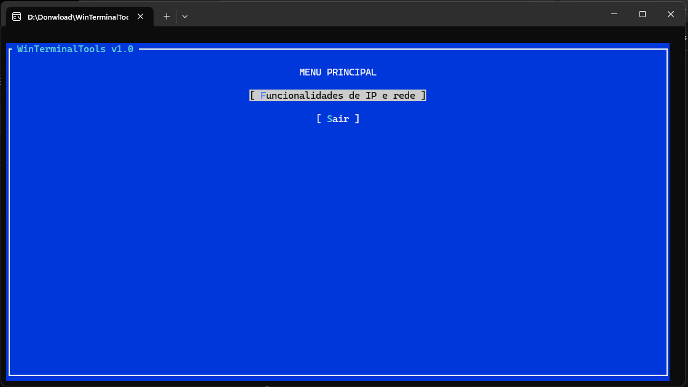
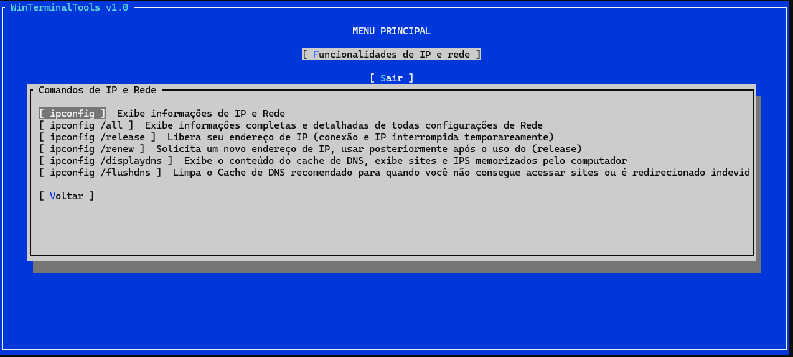
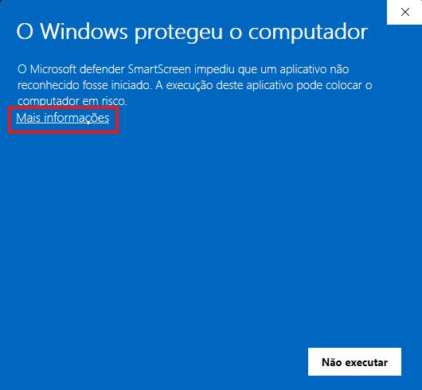
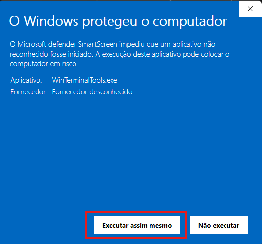

# WinTerminalTools v1.0

É uma ferramenta de console com interface TUI (Text-based User Interface) para Windows 64 bits, projetada para simplificar as tarefas comuns de linha de comando(CMD ou PowerShell), cada instrução possui uma decrião de sua funcionalidade para facilitar o uso, podendo navegar pelo teclado ou mouse.

##

## Sobre o Projeto

Resolvi iniciar o desenvolvimento deste projeto com o intuito de aprender mais sobre as ferramentas possíveis a utilizar no CMD, além das convencionais como ipconfig. Também vi nisto uma maneira de aperfeiçoar meu aprendizado em C# e .NET. No momento, o programa possui apenas uma tela e uma configuração navegável, que é o menu do ipconfig e suas demais funcionalidades, mas a minha ideia para as versões futuras é ter diversas outras funções. Existem programas parecidos, mas ainda não encontrei nenhum que implemente as funcionalidades da forma que imagino.

O WinTerminalTools, o nome vem de uma União de Ferramentas de terminal do Windows, ela é uma ferramenta de código aberto construída e idealizada por min em C# e .NET 8, utilizando a biblioteca Terminal.Gui para criar uma interface de usuário interativa que funciona diretamente no seu terminal. O objetivo é centralizar diversos comandos úteis do Windows (como ipconfig, ping, winget, etc.) em um único local de fácil acesso e com instruções sobre o que cada comando executa. Isso evita que o usuário, ao precisar rodar um comando menos conhecido, tenha que pesquisar externamente sua função, pois o próprio programa já fornecerá uma descrição. O executável suporta tanto a navegação por teclado quanto cliques do mouse.

A ideia de Usar de usar o C# é pela integração com o Windows, e a ideia da interface Terminal.Gui é pelo fato de ser leve e uma interface mais "limpa e simples". 

##

   <strong>Funcionalidade Atuais</strong>

##

  <strong>Menu principal.</strong>

  <strong>Subcommenu do ipconfig com descrições e diálogos de confirmação para ações como ipconfig /release.</strong>

   

##

## Instalação 
    - 1. Baixe o arquivo WinTerminalTools.rar
    - 2. Extraia o conteúdo para uma pasta de sua preferência.
    - 3. Execute o arquivo WinTerminalTools.exe.

<h2 align="center">⚠️ AVISO ⚠️</h2>

### Como este é um projeto pessoal, o executável não possui uma assinatura de código digital paga. É normal que o Windows exiba um aviso de segurança ao executá-lo pela primeira vez, geralmente não aparece novamente as próximas vezes que for executado.

##

  <strong>Ao ver a tela "O Windows protegeu o computador", clique no link de texto "Mais informações".</strong>

  

##

  <strong>Em seguida, um novo botão aparecerá. Clique em "Executar mesmo assim".</strong>

  

##

Contribuindo
1. Abra uma issue descrevendo a mudança desejada.
2. Faça um fork e um branch de feature.
3. Envie um pull request com uma descrição clara.

Licença
Este projeto é licenciado sob a MIT License — veja o arquivo `LICENSE` na raiz para o texto completo.
